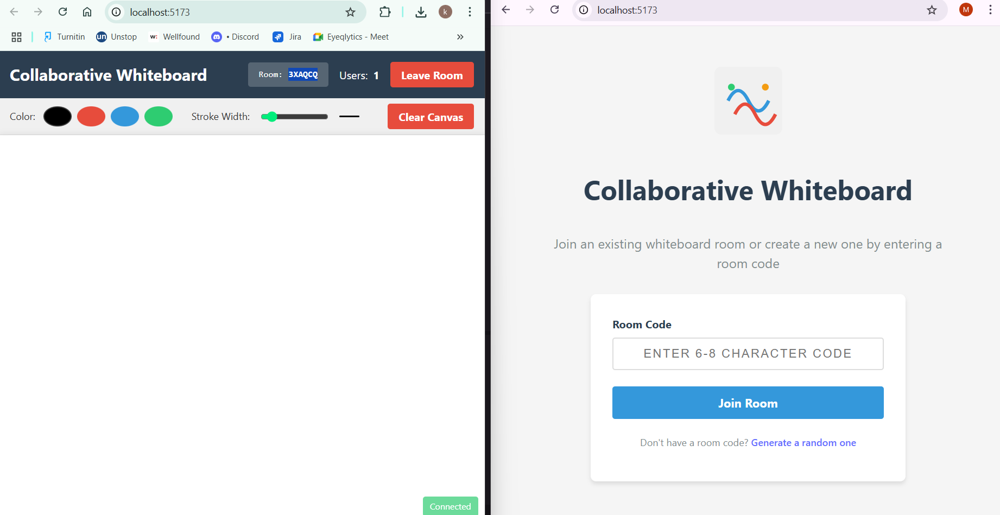
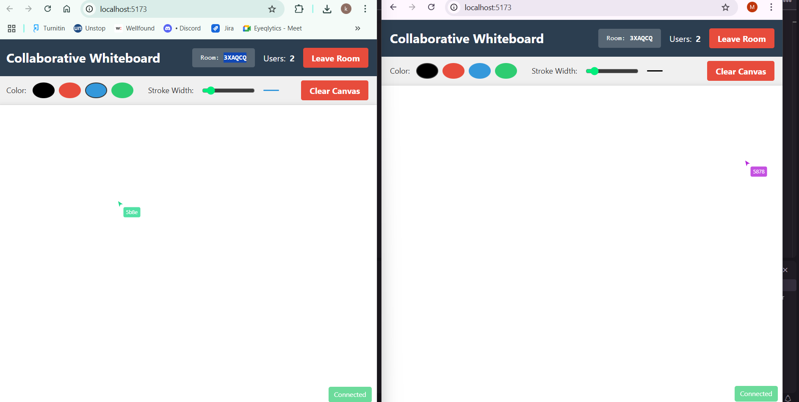
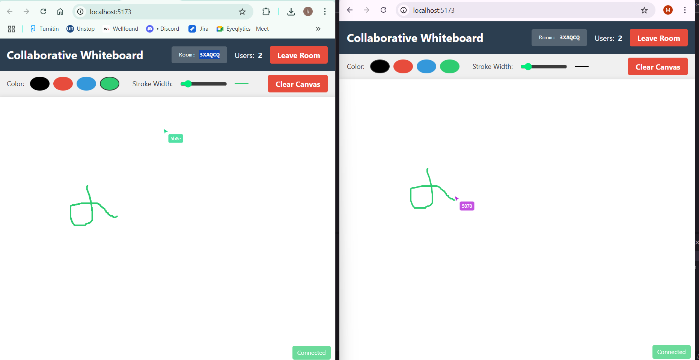
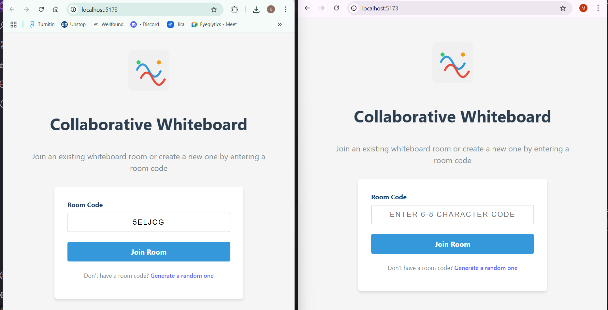

# Collaborative Whiteboard Application

A real-time collaborative whiteboard application built with the MERN stack (MongoDB, Express.js, React.js, Node.js) and Socket.io for live collaboration.

## Features

- Room Management: Join existing rooms or create new ones with simple room codes
- Drawing Functionality: Smooth drawing with adjustable stroke width and color selection
- Live Collaboration: Real-time cursor tracking and drawing synchronization
- User Presence: Display of active users in the room

## Technology Stack

- **Frontend**: React.js
- **Backend**: Node.js with Express.js
- **Database**: MongoDB
- **Real-time Communication**: Socket.io
- **Styling**: CSS/Styled Components

## 🧪 Results

Below are some screenshots of the application in action:

### 🎨 Whiteboard Collaboration with Multiple Users  


### 🧑‍🤝‍🧑 User Cursors Display  


### 🎛️ Drawing Toolbar with Color & Stroke Controls  


### 🧼 Canvas Clear Function  


## Setup Instructions

### Prerequisites

- Node.js (v14 or higher)
- npm or yarn
- MongoDB (local installation or MongoDB Atlas account)

### Installation

1. Clone the repository

```bash
git clone https://github.com/Kalparatna/Workelate-Assignment.git
cd collaborative-whiteboard
```

2. Install dependencies for both client and server

```bash
# Install server dependencies
cd server
npm install

# Install client dependencies
cd ../client
npm install
```

3. Set up environment variables
   - Create a `.env` file in the server directory
   - Add the following variables:

```
MONGODB_URI= add your mongodb string
PORT=5000
```

4. Start the development servers

```bash
# Start the backend server (from the server directory)
npm run dev

# Start the frontend server (from the client directory)
npm start
```

5. Open your browser and navigate to `http://localhost:3000`

## API Documentation

### REST Endpoints

- `POST /api/rooms/join` - Join or create a room
  - Request body: `{ roomId: string }`
  - Response: `{ roomId: string, success: boolean }`

- `GET /api/rooms/:roomId` - Get room information
  - Response: `{ roomId: string, createdAt: date, activeUsers: number }`

### Socket Events

#### Client to Server

- `join-room` - User joins a room
  - Payload: `{ roomId: string, userId: string }`

- `leave-room` - User leaves a room
  - Payload: `{ roomId: string, userId: string }`

- `cursor-move` - Update cursor position
  - Payload: `{ roomId: string, userId: string, x: number, y: number }`

- `draw-start` - Start drawing stroke
  - Payload: `{ roomId: string, userId: string, x: number, y: number, color: string, width: number }`

- `draw-move` - Continue drawing path
  - Payload: `{ roomId: string, userId: string, x: number, y: number }`

- `draw-end` - End drawing stroke
  - Payload: `{ roomId: string, userId: string }`

- `clear-canvas` - Clear the entire canvas
  - Payload: `{ roomId: string, userId: string }`

#### Server to Client

- `user-joined` - New user joined the room
  - Payload: `{ userId: string, activeUsers: number }`

- `user-left` - User left the room
  - Payload: `{ userId: string, activeUsers: number }`

- `cursor-update` - Broadcast cursor position
  - Payload: `{ userId: string, x: number, y: number }`

- `draw-start-broadcast` - Broadcast start of drawing
  - Payload: `{ userId: string, x: number, y: number, color: string, width: number }`

- `draw-move-broadcast` - Broadcast drawing path
  - Payload: `{ userId: string, x: number, y: number }`

- `draw-end-broadcast` - Broadcast end of drawing
  - Payload: `{ userId: string }`

- `canvas-clear` - Broadcast canvas clear
  - Payload: `{ userId: string }`

## Architecture Overview

### Frontend

The React frontend is organized into components:

- `RoomJoin.js` - Handles room code input and joining/creating rooms
- `Whiteboard.js` - Main container for the whiteboard functionality
- `DrawingCanvas.js` - Manages the HTML5 Canvas and drawing logic
- `Toolbar.js` - Contains drawing controls (color, stroke width, clear)
- `UserCursors.js` - Displays other users' cursors on the whiteboard

Socket.io client connects to the server for real-time updates and synchronization.

### Backend

The Node.js/Express backend handles:

- REST API endpoints for room management
- Socket.io server for real-time communication
- MongoDB connection for data persistence

Drawing data is stored as incremental updates rather than full canvas states to optimize performance.

### Data Flow

1. User joins a room via the REST API
2. Socket connection is established for real-time updates
3. Drawing actions are captured on the client and sent to the server
4. Server broadcasts actions to all connected clients in the same room
5. Clients render the received drawing actions on their local canvas


- Set up proper error handling and reconnection logic for Socket.io
- Consider implementing a cleanup job for inactive rooms
- Monitor performance and optimize as needed
